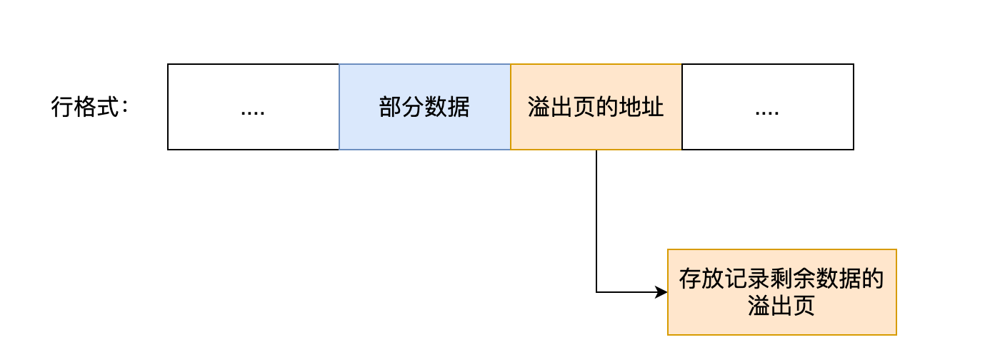
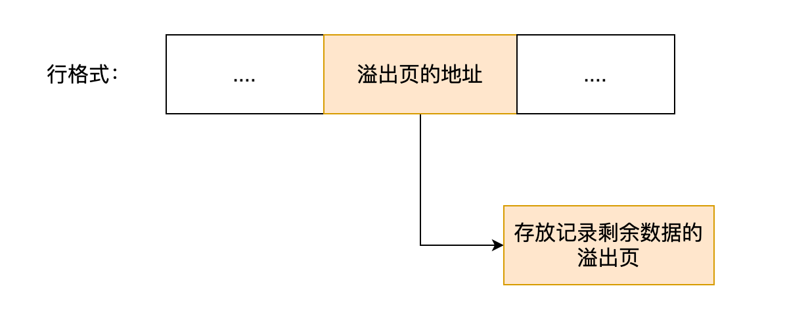

## 一、Mysql 数据存放在那个文件

查看 Mysql 数据库的文件存放在哪个目录：

```sql
SHOW VARIABLES LIKE 'datadir';
```

没创建一个 databse，就会在 /var/lib/mysql/ 目录里面创建一个以 database 为名的目录，然后保存表结构和表数据的文件都会放在这个目录里。

一个数据库下回存放三个文件，分别代表：

- **db.opt**：用来存储当前数据库的默认字符集和及支付校验规则；
- **t_order.frm**：t_order 的表结构会存放在这个文件。在 MySQL 中建立一张表都会生成一个.frm 文件，该文件用来保存每个表的元数据信息，主要包含表结构定义；
- **t_order.idb**：t_order 的表数据会保存在这个文件。表数据既可以存在共享表空间文件（文件名：ibdata1）里，也可以存放在独占表空间文件（文件名：表名字.ibd）。这个行为是由参数 innodb_file_per_table 控制的，若设置了参数 innodb_file_per_table 为 1，则会将存储的数据、索引等信息单独存储在一个独占表空间，从 MySQL 5.6.6 版本开始，它的默认值就是 1 了，因此从这个版本之后， MySQL 中每一张表的数据都存放在一个独立的 .ibd 文件。

一张数据库表的数据是保存在「 表名字.ibd 」的文件里的，这个文件也称为独占表空间文件。

**表空间文件的结构是怎样的？**

表空间有段（segment）、区（extent）、页（page）、行（row）组成，InnoDB 存储引擎的逻辑存储结构如下图：

1. 行（row）

   数据库表中的记录都是按行（row）进行存放的，每行记录根据不同的行格式，有不同的存储结构。

2. 页（page）

   记录是按行来存储的，InnoDB 的数据是按照 **页** 为单位来读写的。也就是说，当需要读一条记录时，并不是将这行记录从磁盘中读出来，而是以 **页** 为单位，将其整体读入内存。

   默认每页大小为 16KB ，最多能保证 16KB 的连续空间。

   页的类型：数据页、undo 日志页、溢出页等等。数据表中的记录是按数据页来管理的。

3. 区（extent）

   InnoDB 存储引擎是用 B+ 树来组织数据的。

   在表中，为某个索引分配空间的时候，不在按照页为单位分配，而是按照区（extent）为单位分配，每个区大小为 1MB ，对于 16KB 的页来说，连续的 64 个页会被划为一个区。这样就是的立案表中相邻页物理位置页相邻，就能使用顺序 I/O 了。

4. 段（segment）

   表空间是由各个段组成，段有多个区组成。段一般划分成数据段、索引段和回滚段。

   - 索引段：存放 B+ 树非叶子节点的区的集合；
   - 数据段：存放 B+ 树叶子结点的区的集合；
   - 回滚段：存放的是回滚数据的区的集合。

## 二、InnoDB 行格式

InnoDB 提供了 4 种行格式，分别是 Redundant、Compact、Dynamic和 Compressed 行格式。

Compact 行格式：


- 额外信息
  - 变长字段长度列表：
    - 记录变长字段的长度（varchar），逆序存放；
    - 不会保存置为 `NULL` 的变长字段长度，因为 `NULL` 不会存放在真实数据部分；
    - 非必须。
  - `NULL` 值列表
    - 每列对应一个二进制位（bit），逆序存放；
    - 必须用证书个字节的位表示，不足高位补0；
    - 非必须。
  - 记录头信息
    - delete_mask：标识此条数据是否被删除；删除一行后，对应的页会被标识可悲重用；
    - next_record：指向下一条记录的 *记录头信息* 和 *真实数据* 之间的位置；
    - record_type：标识当前记录的类型，0 标识普通记录，1 表示B+树非叶子结点记录，2 表示最小记录，3 表示最大记录。
- 真实数据
  - 隐藏字段
    - row_id：如果建表制定了主键或唯一约束，就没有 row_id ，占用 6 个字节；非必须；
    - trx_id：事务id ，表示这个数据是由那个事务生成的；占用 6 个字节；必须的；
    - roll_pointer：这条记录上一个版本的指针；占用 7 个字节；必须的；
  - 列值

## 三、`varchar(n)`

n 表示最多存储的字符数量，根据字符集计算算占用的字节大小。

MySQL 规定除了 TEXT、BLOBs 这种大对象类型之外，其他所有的列（不包括隐藏列和记录头信息）占用的字节长度加起来不能超过 65535 个字节。

## 四、行溢出后，MySQL 如何处理

页 的大小是 16KB，varchar(n)、TEXT、BLOB可能对导致一页存储不了一条记录，发生行溢出，多的数据存放到另外的 *溢出页* 中。

一般情况下，InnoDB 数据都存放在 *数据页* 中，当发生行溢出时，溢出的数据会存放在 *溢出页* 中。真实数据中用20个字节存储溢出页的地址。



Compressed 和 Dynamic 格式采用完全行溢出处理：


