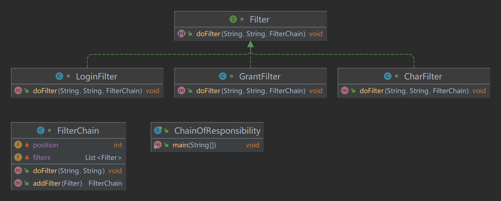

## 名称

责任链模式

## 目的

通过给多个对象一个处理请求的机会，避免请求的发送者和接受者耦合。串联接受对象并在链条中传递知道一个对象梳理它。

## 程序用例

```java
/**
 * 过滤器首相接口
 */
interface Filter {
    void doFilter(String request, String response, FilterChain filterChain);
}

/**
 * 过滤器链
 */
class FilterChain {
    private List<Filter> filters = new ArrayList<>();
    private int position = 0;

    public void doFilter(String request, String response) {
        if (position >= filters.size()) return;

        Filter filter = filters.get(this.position++);

        filter.doFilter(request, response, this);
    }

    public FilterChain addFilter(Filter filter) {
        this.filters.add(filter);
        return this;
    }
}

/**
 * 登录过滤器
 */
class LoginFilter implements Filter {

    @Override
    public void doFilter(String request, String response, FilterChain filterChain) {
        System.out.println("Login filter start ……");
        filterChain.doFilter(request, response);
        System.out.println("Login filter end ！");
    }
}

/**
 * 字符修改过滤器
 */
class CharFilter implements Filter {

    @Override
    public void doFilter(String request, String response, FilterChain filterChain) {
        System.out.println("Char filter start ……");
        filterChain.doFilter(request, response);
        System.out.println("Char filter end ！");
    }
}

/**
 * 权限校验过滤器
 */
class GrantFilter implements Filter {

    @Override
    public void doFilter(String request, String response, FilterChain filterChain) {
        System.out.println("Grant filter start ……");
        filterChain.doFilter(request, response);
        System.out.println("Grant filter end ！");
    }
}

public class ChainOfResponsibility {


    public static void main(String[] args) {
        Filter loginFilter = new LoginFilter();
        Filter charFilter = new CharFilter();
        Filter grantFilter = new GrantFilter();

        FilterChain filterChain = new FilterChain();

        filterChain.addFilter(loginFilter).addFilter(charFilter).addFilter(grantFilter);

        filterChain.doFilter("request", "response");

    }
}
```

## UML



## 使用性

- 多个对象可能要处理请求，并且处理器并不知道优先级，处理器赢自动确认；
- 对多个对象之一发送请求而无需明确指定接受者；
- 处理请求的对象集合应该被动态指定时。

## Java 中的用例

- [java.util.logging.Logger#log()open in new window](http://docs.oracle.com/javase/8/docs/api/java/util/logging/Logger.html#log(java.util.logging.Level, java.lang.String))
- [Apache Commons Chainopen in new window](https://commons.apache.org/proper/commons-chain/index.html)
- [javax.servlet.Filter#doFilter()](http://docs.oracle.com/javaee/7/api/javax/servlet/Filter.html#doFilter-javax.servlet.ServletRequest-javax.servlet.ServletResponse-javax.servlet.FilterChain-)