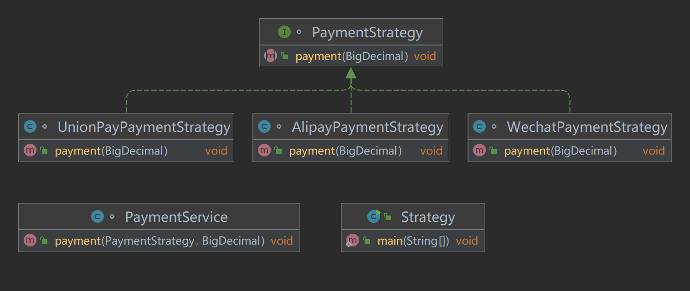

## 名称

策略模式、政策模式、方针模式

## 目的

定义一个家族算法，并封装好其中每一个，使他们可以相互替换。策略模式是算法的变化独立于使用它的客户。

## 程序用例

```java
/**
 * 策略接口
 */
interface PaymentStrategy {
    void payment(BigDecimal amount);
}

/**
 * 微信支付策略
 */

class WechatPaymentStrategy implements PaymentStrategy {

    @Override
    public void payment(BigDecimal amount) {
        System.out.println("使用微信支付" + amount);
    }
}

/**
 * 支付宝支付
 */
class AlipayPaymentStrategy implements PaymentStrategy {

    @Override
    public void payment(BigDecimal amount) {
        System.out.println("使用支付宝支付" + amount);
    }
}

/**
 * 云闪付支付
 */
class UnionPayPaymentStrategy implements PaymentStrategy {
    @Override
    public void payment(BigDecimal amount) {
        System.out.println("使用云闪付支付" + amount);
    }
}

/**
 * 支付服务
 */
class PaymentService {
    public void payment(PaymentStrategy paymentStrategy, BigDecimal amount) {
        paymentStrategy.payment(amount);
    }
}

/**
 * 测试
 */
public class Strategy {
    public static void main(String[] args) {
        PaymentService paymentService = new PaymentService();

        paymentService.payment(new AlipayPaymentStrategy(), new BigDecimal("100"));
        paymentService.payment(new WechatPaymentStrategy(), new BigDecimal("100"));
        paymentService.payment(new UnionPayPaymentStrategy(), new BigDecimal("100"));

    }
}
```

## UML



## 适用性

- 许多相关的类只是行为不同，策略模式提供一种为一种类配置多种行为的能力；
- 需要一种算法的不同变体；
- 一个算法使用的数据，客户不应该对其知晓。使用策略模式来避免暴露复杂的，特定于算法的数据结构；
- 一个类定义了许多行为，这些行为在其操作中展现为多个条件语句。