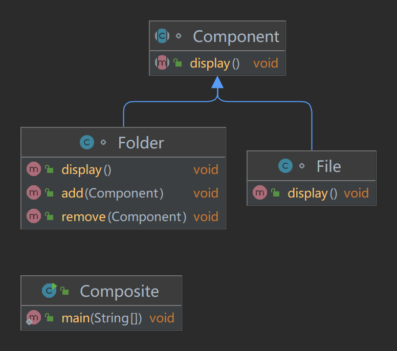

## 名称

组合模式

## 目的

讲对象组合成树结构以表示部分整体层次结构。组合可以是客户同一对待单个对象和组合对象。

## 程序示例

```java
/**
 * 抽象组件类
 */
abstract class Component {
    protected String name;

    public Component(String name) {
        this.name = name;
    }

    public abstract void display();
}

/**
 * 叶子结点类
 */
class File extends Component {

    public File(String name) {
        super(name);
    }

    // 展示
    @Override
    public void display() {
        System.out.println(name);
    }
}

/**
 * 组合节点类
 */
class Folder extends Component {

    private List<Component> children = new ArrayList<>();

    public Folder(String name) {
        super(name);
    }

    // 添加
    public void add(Component component) {
        children.add(component);
    }

    // 删除
    public void remove(Component component) {
        children.remove(component);
    }

    // 展示
    @Override
    public void display() {
        System.out.println(name);
        for (Component child : children) {
            child.display();
        }
    }
}

/**
 * 主类
 */
public class Composite {
    public static void main(String[] args) {
        Folder root = new Folder("root");
        Component file1 = new File("file1");
        Component file2 = new File("file1");
        Folder folder1 = new Folder("folder1");
        Component file3 = new File("file3");
        Folder folder2 = new Folder("folder2");
        Component file4 = new File("file4");

        folder2.add(file4);
        folder1.add(file3);
        folder1.add(folder2);
        root.add(file1);
        root.add(file2);
        root.add(folder1);

        root.display();
    }
}
```

## UML



## 适用性

- 想要表示对象的整体层次结构；
- 希望客户能够忽略组合对象和单个对象之间的差异，客户将同一对待组合结构中的所有对象。

## Java 中的用例

- [java.awt.Container](http://docs.oracle.com/javase/8/docs/api/java/awt/Container.html)
- [java.awt.Component](http://docs.oracle.com/javase/8/docs/api/java/awt/Component.html)

